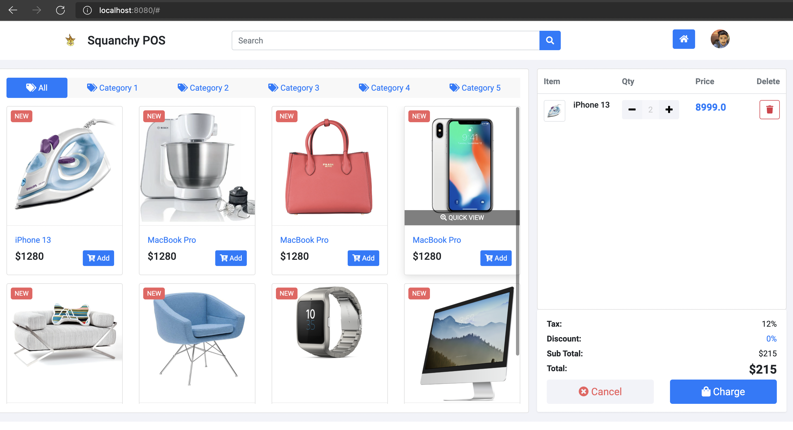

# WebPOS

The demo shows a simple POS system in MVC architecture, which replaces the shell interface in aw02 with a pos web ui (https://github.com/bshbsh404/simple-pos-ui
).



To run

```shell
mvn clean spring-boot:run
```

Currently, it just lists the products for sale with a cart with one item (just for demonstration). 

Please read the tutorial at  https://www.baeldung.com/spring-boot-crud-thymeleaf and make the POS system robust and fully functional. You can also refer to other articles, for instance https://www.baeldung.com/tag/thymeleaf/ .


And please elaborate your understanding in MVC architecture via this homework in your README.md.


## MVC 架构理解

Model-View-Controller 这种架构对于交互和数据分离做的很好，说白了就是前后端分离思想

* Model 作为数据中心，存储数据并提供基本数据操作，属于后端
* View 作为交互界面，为用户提供交互，属于前端
* Controller 在数据和交互之间作为交换和沟通的桥梁，属于中间端或后端

我们的作业里，Controller 内含一个 Service，Service 封装了前端用户交互所需要与后端沟通的接口。用户的操作实际上是在请求 Controller 提供的 API，而 Controller 里的 API 通过调用 Service 这个桥梁即可访问 Model 即 PosDB，与底层数据进行交流。由于多了一层封装，在做权限控制的时候更加得心应手；一些后端的高级别或危险操作（比如商品列表的更改）并未暴露给前端，于是这种分离可以保证安全性。